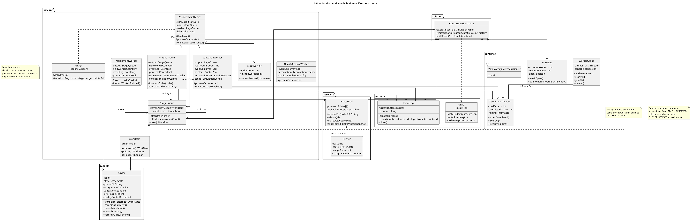
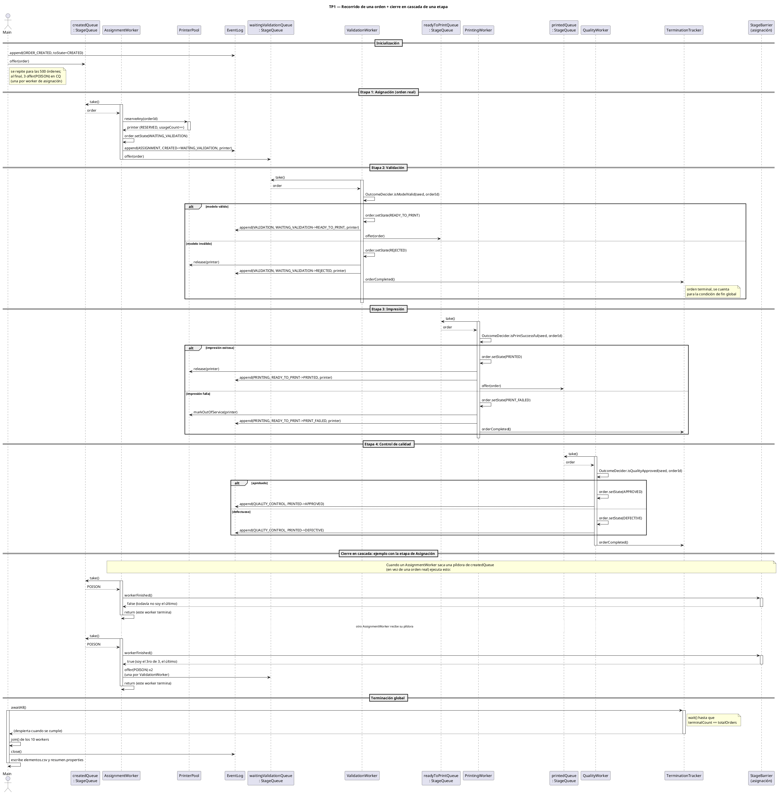

# Integrantes y repositorio

| Nombre | Documento | Usuario Git |
| --- | --- | --- |
| Rafael Barrio | [[TODO]] | [[TODO]] |
| Alexis Tomás Garay | [[TODO]] | [[TODO]] |
| Pedro Guzman Gonzalez | [[TODO]] | [[TODO]] |
| Santino Chesta | [[TODO]] | [[TODO]] |
| Valentino Zuchella Paz | [[TODO]] | [[TODO]] |

- **Grupo:** Warrior-of-Interruptions
- **Repositorio:** [[TODO: URL]]
- **Tag de entrega:** `Warrior-of-Interruptions-entrega-tp1`

# 1. Introducción y objetivo

El trabajo simula una granja industrial de impresión 3D. El sistema recibe órdenes
de fabricación, les asigna una impresora, valida el modelo, ejecuta la impresión y
controla la calidad de la pieza obtenida. Cada orden comienza en `CREATED` y
finaliza exactamente en uno de cuatro estados terminales: `APPROVED`, `REJECTED`,
`PRINT_FAILED` o `DEFECTIVE`.

Los objetivos son: (i) que las cuatro etapas funcionen **concurrentemente**,
(ii) que compartan recursos de manera segura, (iii) que todas las órdenes se
procesen conservando la consistencia de sus estados y (iv) que la simulación
finalice sin dejar hilos activos ni impresoras reservadas.

El sistema se implementa en Java 21 con Maven. La decisión de validación,
impresión y calidad se delega exclusivamente en `OutcomeDecider`, provisto por la
cátedra, de modo que el resultado final de cada orden es determinista para una
semilla e identificador dados.

# 2. Arquitectura general

La solución organiza el trabajo como un **pipeline de cuatro etapas** comunicadas
por colas FIFO. El hilo principal (`main`) crea las órdenes y las deposita en la
primera cola; a partir de ahí, los workers avanzan cada orden por el recorrido:

```text
CREATED
  │ asignación: reserva una impresora
  ▼
WAITING_VALIDATION
  │ validación
  ├── modelo inválido ──► REJECTED (libera impresora)
  ▼
READY_TO_PRINT
  │ impresión
  ├── falla ───────────► PRINT_FAILED (impresora fuera de servicio)
  ▼
PRINTED
  │ control de calidad
  ├── aprobada ────────► APPROVED
  └── defectuosa ──────► DEFECTIVE
```

La cantidad de workers por etapa se toma de la configuración (config oficial:
3 asignación, 2 validación, 3 impresión, 2 calidad). **Todas las etapas se inician
al comienzo**: cada worker se registra y espera en una compuerta común
(`StartGate`) hasta que el principal confirma que los diez están listos y la abre.
De este modo ninguna etapa procesa una orden antes de que todas hayan arrancado.

El código se divide en un contrato fijo (`ar.edu.unc.fcefyn.pcp.tp1.api`, provisto
por la cátedra y no modificado) y la implementación propia bajo `solution.internal`,
subdividida en `model` (estado de las órdenes), `pipeline` (colas, workers,
píldoras), `resource` (matriz de impresoras), `runtime` (arranque, ciclo de vida y
terminación) y `output` (eventos y archivos de resultado).

## 2.1 Diagrama de clases



`ConcurrentSimulation` es el punto de entrada: crea las órdenes y las impresoras,
las cuatro `StageQueue` y los diez workers. Los cuatro workers de etapa
(`AssignmentWorker`, `ValidationWorker`, `PrintingWorker`, `QualityControlWorker`)
heredan de `AbstractStageWorker`, que concentra el protocolo común (retirar de la
cola, reconocer píldoras, reportar al `StageBarrier`). `WorkItem` envuelve el
trabajo que circula entre colas (una orden o una píldora) y `StageQueue` es la
frontera FIFO entre etapas. `PrinterPool` administra la matriz de impresoras y las
clases de `runtime` (`StartGate`, `StageBarrier`, `TerminationTracker`,
`WorkerGroup`) coordinan arranque, cierre y terminación.

## 2.2 Diagrama de secuencia



La secuencia comienza con el **arranque conjunto**: los diez workers se registran y
quedan esperando en `StartGate` hasta que `main` abre la compuerta; así ninguna etapa
procesa una orden antes de que todas las etapas estén iniciadas. Luego se sigue el
**recorrido feliz** de una orden: `CREATED → asignación (reserva una impresora) →
WAITING_VALIDATION → READY_TO_PRINT → impresión → PRINTED → calidad → APPROVED`.
El diagrama incluye las **salidas anticipadas**: modelo inválido → `REJECTED`
(libera la impresora) y fallo de impresión → `PRINT_FAILED`. En cada transición el
worker registra el evento en `EventLog` —asignando el `sequence`— antes de encolar
la orden en la etapa siguiente.

# 3. Recursos compartidos

Los recursos compartidos y el mecanismo que los protege son:

| Recurso | Clase | Mecanismo | Quién escribe | Quién lee | Invariantes |
| --- | --- | --- | --- | --- | --- |
| Órdenes `CREATED` esperando asignación | `createdQueue` | `Semaphore` + monitor interno | `main` (inicial) | workers de asignación | INV-01, INV-03 |
| Órdenes `WAITING_VALIDATION` | `validationQueue` | `Semaphore` + monitor interno | workers de asignación | workers de validación | INV-01, INV-03 |
| Órdenes `READY_TO_PRINT` | `printingQueue` | `Semaphore` + monitor interno | workers de validación | workers de impresión | INV-01, INV-03 |
| Órdenes `PRINTED` | `qualityQueue` | `Semaphore` + monitor interno | workers de impresión | workers de calidad | INV-01, INV-03 |
| Matriz de impresoras y disponibilidad | `PrinterPool` | `synchronized` + `Semaphore` | asignación (reserva); validación/impresión (libera o inhabilita) | los diez workers | INV-04…INV-08, INV-10 |
| Registro de eventos y contador `sequence` | `EventLog` | `synchronized` | los diez workers + `main` | — | EVT-03, EVT-08 |
| Contador de órdenes terminales | `TerminationTracker` | `synchronized` + `wait`/`notifyAll` | validación/impresión/calidad | `main` | TRM-01 |
| Cierre de cada etapa | `StageBarrier` | `synchronized` | workers de la etapa | — | INV-09, INV-10 |
| Compuerta de arranque | `StartGate` | `synchronized` + `wait`/`notifyAll` | `main` y workers | workers | GEN-04 |

`Order` y `Printer` **no tienen lock propio**: en todo momento una orden es
propiedad de un único worker (el que la retiró de una cola) y una impresora solo se
modifica dentro de la sección crítica de `PrinterPool`. La exclusión mutua la
aportan los recursos de la tabla, no los objetos de datos.

# 4. Condiciones de carrera posibles y cómo se evitan

1. **Dos workers de asignación reservan la misma impresora.** Se adquiere primero
   un permiso del semáforo de impresoras disponibles y luego `reserveFor` busca y
   marca `RESERVED` dentro de una única sección `synchronized` (INV-04).
2. **Una orden es tomada por dos workers de la misma etapa.** `StageQueue.take()`
   hace `acquire()` del semáforo y la extracción de la deque como una operación
   atómica respecto de otros `take`/`offer` (INV-01, INV-03).
3. **El evento se registra en un orden distinto al de la transición.** Cada worker
   cambia el estado, registra el evento y recién entonces encola la orden en la
   etapa siguiente; como la orden tiene un único dueño, no puede intercalarse con
   otro hilo (EVT-08).
4. **Una orden "se pierde" entre cambiar de estado y encolarse.** El cambio de
   estado, el registro y el `offer` ocurren en secuencia dentro del mismo worker,
   sin que la orden pase por otro hilo en el medio.
5. **Una píldora se inyecta antes de encolar todas las órdenes reales.** Las
   píldoras se encolan detrás de las órdenes en la misma FIFO, y el `StageBarrier`
   solo confirma el cierre cuando el último worker consumió su píldora, momento en
   el que ya encoló todo su trabajo.
6. **Se libera una impresora inexistente o no reservada.** `release` y
   `markOutOfService` verifican el estado previo y lanzan excepción ante una
   inconsistencia.

# 5. Estrategia de sincronización

## 5.1 Colas entre etapas (`StageQueue`)

Cada frontera del pipeline tiene una cola FIFO (`ArrayDeque`) protegida por un
monitor propio y un `Semaphore` que cuenta los elementos disponibles. El productor
inserta el elemento bajo el monitor y luego publica un permiso; el consumidor
adquiere un permiso y solo entonces retira el elemento. El semáforo evita la espera
activa y modela exactamente "cuántos elementos hay esperando" sin que cada worker
reevalúe una condición a mano, evitando además el efecto *thundering herd* de un
`notifyAll` sobre una condición.

## 5.2 Pool de impresoras (`PrinterPool`)

`PrinterPool` administra tanto la matriz como un `Semaphore` de impresoras
disponibles. Reservar = adquirir un permiso + marcar `AVAILABLE → RESERVED` bajo
`synchronized`. Liberar = marcar `RESERVED → AVAILABLE` y devolver el permiso. Una
impresora que falla pasa a `OUT_OF_SERVICE` y **no** devuelve el permiso, por lo que
nunca se reutiliza (INV-07). El semáforo bloquea sin espera activa cuando todas las
impresoras están ocupadas, incluso con una sola impresora.

## 5.3 Registro de eventos (`EventLog`)

El contador `sequence` y la escritura de la fila se realizan bajo un mismo
`synchronized`: la asignación del número y el volcado al archivo son una única
operación lógica, de modo que la secuencia es creciente, única y respeta el orden de
escritura.

## 5.4 Coordinación de arranque y cierre

- `StartGate` (arranque conjunto) y `StageBarrier` (último worker de la etapa) usan
  monitores.
- `TerminationTracker` usa `wait`/`notifyAll`: el principal espera a que todas las
  órdenes alcancen un estado terminal o a que algún worker falle.

## 5.5 Por qué no hay locks en `Order`/`Printer`

El diseño respeta *ownership* de un solo hilo por objeto en cada instante: una orden
vive en exactamente una cola o en la mano de un único worker, y una impresora solo
se toca dentro de `PrinterPool`. Añadir `synchronized` a los accesos de `Order`
sería redundante y ocultaría el verdadero punto de exclusión mutua.

## 5.6 Justificación de la elección

Se optó por una cola por transición con semáforo + monitor (en lugar de un único
lock global o de `wait/notify` directo sobre las listas) porque cada etapa espera
solo por su propia bandeja de entrada sin bloquear a las demás, el modelo es el
mismo para las cuatro fronteras (una sola clase reutilizable) y el semáforo
encapsula el conteo de elementos disponibles de forma correcta.

# 6. Condiciones de espera y despertar de los hilos

| Hilo | Dónde espera | Condición de espera | Quién lo despierta |
| --- | --- | --- | --- |
| Los diez workers | `StartGate.awaitOpen()` | La compuerta no está abierta | `main` con `notifyAll()` al confirmar que todos llegaron |
| Los diez workers | `StageQueue.take()` → `Semaphore.acquire()` | No hay elemento en su cola | Un productor con `release()` tras encolar |
| Workers de asignación | `PrinterPool.reserveFor` → `acquire()` | No hay impresoras disponibles | `release()` al liberar una impresora |
| `main` | `TerminationTracker.awaitAll()` | Aún no terminaron todas las órdenes ni hubo fallo | `orderCompleted()`/`fail()` con `notifyAll()` |
| `main` | `WorkerGroup.joinAll()` | Algún worker sigue vivo | La finalización del worker |

# 7. Mecanismo de terminación

**Píldoras + barrera, en cascada.** Junto con las órdenes reales se encola una
píldora (valor centinela) por cada worker consumidor de la cola. Como las píldoras
van detrás de las órdenes reales en la misma FIFO, ningún worker las recibe antes de
que se haya encolado todo el trabajo. Al consumir su píldora, cada worker registra
su cierre en el `StageBarrier` de su etapa; el **último** en llegar es el único que
fabrica e inyecta las píldoras de la etapa siguiente. La calidad, última etapa, no
inyecta nada.

En paralelo, cada vez que una orden llega a un estado terminal
(`APPROVED`, `REJECTED`, `PRINT_FAILED`, `DEFECTIVE`) el worker correspondiente
avisa a `TerminationTracker`. El principal está bloqueado en `awaitAll()` y se
despierta cuando el contador llega a `totalOrders`; entonces hace `join()` de los
diez hilos, cierra el registro de eventos y escribe los archivos de resultado. Esto
garantiza que al finalizar no queden órdenes en estados intermedios (INV-09) ni
impresoras `RESERVED` (INV-10).

**Cancelación ante fallos.** Si un worker lanza una excepción o se lo interrumpe, el
`WorkerGroup` registra el primer fallo en el `TerminationTracker` e interrumpe a
todos los workers; los que estaban bloqueados en un semáforo o una demora despiertan
con `InterruptedException` y terminan. El principal espera su cierre y relanza el
fallo. No se usa `Thread.stop` ni `System.exit`.

# 8. Determinismo

La decisión de cada etapa se toma exclusivamente con `OutcomeDecider`, cuyos
resultados dependen solo de la semilla de configuración y del identificador de la
orden. Como cada orden recorre el pipeline exactamente una vez (asignación,
validación, impresión y calidad a lo sumo una vez), los estados finales son
independientes del orden en que se entrelacen los hilos. No se exige igualdad en la
impresora asignada, los contadores individuales ni los tiempos.

# 9. Análisis teórico del tiempo de ejecución

El sistema es un pipeline (línea de ensamblaje). Sea `d_i` la demora por orden de la
etapa `i` y `W_i` su cantidad de workers. En régimen estacionario, la etapa `i`
procesa una orden cada `d_i / W_i`; el **ciclo del sistema** lo fija la etapa más
lenta:

```text
ciclo = max_i ( d_i / W_i )
```

El tiempo total aproximado es la latencia de llenado más el ciclo por cada orden
restante:

```text
makespan ≈ ( Σ_i d_i ) + (N − 1) · ciclo
```

Con la configuración oficial (`N = 500`, `d = 50/120/180/80` ms,
`W = 3/2/3/2`):

| Etapa | `d_i` (ms) | `W_i` | `d_i / W_i` (ms) |
| --- | ---: | ---: | ---: |
| Asignación | 50 | 3 | 16.7 |
| Validación | 120 | 2 | **60** |
| Impresión | 180 | 3 | **60** |
| Calidad | 80 | 2 | 40 |

Validación e impresión son **cuellos de botella conjuntos** (60 ms por orden).
Predicción:

```text
makespan ≈ 430 + 499 · 60 = 30 370 ms ≈ 30.4 s
```

**Predicciones del barrido.** Como validación e impresión están empatadas como
cuello de botella, agregar un worker a *una sola* de ellas no debería mejorar el
tiempo (la otra sigue en 60 ms); agregarlo a *ambas* sí lo reduce. Algunas
predicciones:

| Configuración (asig/val/imp/c cal) | ciclo teórico | makespan teórico |
| --- | ---: | ---: |
| 1/1/1/1 | 180 ms | ≈ 90.3 s |
| 2/2/2/2 | 90 ms | ≈ 45.3 s |
| 3/2/3/2 (oficial) | 60 ms | ≈ 30.4 s |
| 3/4/3/2 | 60 ms | ≈ 30.4 s (sin mejora) |
| 3/2/4/2 | 60 ms | ≈ 30.4 s (sin mejora) |
| 3/4/4/2 | 45 ms | ≈ 22.9 s |
| 4/4/4/4 | 45 ms | ≈ 22.9 s |

# 10. Resultados experimentales

## 10.1 Protocolo

- Configuración oficial salvo la variable que se modifique en cada barrido.
- Semilla fija, de modo que los estados finales son idénticos entre corridas y solo
  varía el tiempo.
- Cinco corridas por variante; se reporta mediana (mín.–máx.) de `durationMillis`.
- Entorno de medición: AMD Ryzen 5 2600 (6 núcleos / 12 hilos lógicos), 16 GB de
  RAM, Windows 11 Pro, OpenJDK 25 (JetBrains Runtime).

## 10.2 Corrida oficial

Las cinco corridas produjeron **exactamente la misma distribución de estados
finales**, lo que confirma el determinismo derivado de `OutcomeDecider` con semilla
fija. Solo varió el tiempo:

| Corrida | durationMillis | approved | rejected | printFailed | defective |
| --- | ---: | ---: | ---: | ---: | ---: |
| 1 | 30 589 | 359 | 71 | 45 | 25 |
| 2 | 30 574 | 359 | 71 | 45 | 25 |
| 3 | 30 896 | 359 | 71 | 45 | 25 |
| 4 | 31 854 | 359 | 71 | 45 | 25 |
| 5 | 31 899 | 359 | 71 | 45 | 25 |
| **Mediana** | **30 896** | 359 | 71 | 45 | 25 |

La dispersión entre corridas es de aproximadamente 4 % (30 574–31 899 ms).

## 10.3 Comparación teórico vs observado

La mediana observada (30 896 ms) coincide con la predicción teórica (30 370 ms)
dentro de aproximadamente un 1.7 %. La diferencia se explica por el arranque de la
JVM, la latencia de llenado y vaciado del pipeline, la contención del registro de
eventos (sección 12) y el *scheduling* del sistema operativo. La coincidencia
valida el modelo de cuello de botella de la sección 9: las etapas gobernantes son
validación e impresión, ambas con un ciclo de 60 ms por orden.

## 10.4 Efecto de cambiar la cantidad de hilos

Con las demoras oficiales fijas, el ciclo de la etapa `i` es `demoraᵢ / hilosᵢ` y el
makespan predicho es `Σdemoras + (N−1)·max(cicloᵢ)` (sección 9). El runner
`tools/analisis/run-experiments.ps1 -Scenario Threads` genera las siguientes
variantes:

| asig/val/imp/cal | cuello de botella | ciclo (ms) | makespan teórico (ms) |
| --- | --- | ---: | ---: |
| 1/1/1/1 | impresión | 180 | ~90 250 |
| 2/2/2/2 | impresión | 90 | ~45 340 |
| 3/2/3/2 (oficial) | validación = impresión | 60 | ~30 370 |
| 3/4/3/2 | impresión | 60 | ~30 370 |
| 3/2/4/2 | validación | 60 | ~30 370 |
| 3/4/4/2 | impresión | 45 | ~22 885 |
| 4/4/4/4 | impresión | 45 | ~22 885 |

La hipótesis central es que **aumentar un solo cuello de botella no reduce el
makespan** (3/4/3/2 y 3/2/4/2 quedan en ~30 s) y que **aumentar ambos sí lo reduce**
(3/4/4/2 cae a ~22.9 s). La ejecución de este barrido quedó como trabajo futuro
(sección 12); el runner ya está listo para reproducirla con la corrida oficial.

## 10.5 Efecto de cambiar las demoras

Escalando todas las demoras por un factor `k` con los hilos oficiales (3/2/3/2), el
makespan predicho es `k·430 + (N−1)·max(cicloᵢ(k))`, con `cicloᵢ = k·demoraᵢ/hilosᵢ`.
Variantes del runner (`-Scenario Delays`):

| factor | demoras (ms) | cuello | ciclo (ms) | makespan teórico (ms) |
| --- | --- | --- | ---: | ---: |
| ×0 | 0/0/0/0 | — | 0 | ~0 (solo overhead) |
| ×0.5 | 25/60/90/40 | validación = impresión | 30 | ~15 185 |
| ×1 (oficial) | 50/120/180/80 | validación = impresión | 60 | ~30 370 |
| ×2 | 100/240/360/160 | validación = impresión | 120 | ~60 740 |

Para `k > 0` el tiempo crece de forma aproximadamente lineal con el factor y
validación e impresión vuelven a empatar como cuello de botella. La ejecución quedó
pendiente (sección 12).

# 11. Justificación de las decisiones de diseño

El ADR-01 documenta la decisión central: una **cola por transición** de etapa
(`StageQueue`: FIFO con `Semaphore` + lock interno) en lugar de un lock global o de
`wait/notify` manual.

- **Frente a un lock global (opción A):** un único lock serializaría etapas que no
  compiten por el mismo dato y no reflejaría que cada etapa es un recurso lógico
  distinto. La cola por transición permite que una etapa lenta solo haga crecer su
  propia bandeja de entrada sin bloquear a las demás.
- **Frente a `wait/notifyAll` manual (opción C):** el semáforo encapsula el conteo
  de "cuántas órdenes esperan" y evita el *thundering herd* de despertar a todos los
  workers de una etapa por un solo ítem nuevo.
- **Ownership de un solo hilo por objeto:** una orden es tocada por un único hilo a
  la vez (el que la extrajo de la cola) y una impresora solo se modifica dentro de
  la sección crítica de `PrinterPool`. Por eso `Order` y `Printer` no llevan lock
  propio: la exclusión mutua la dan las estructuras compartidas.
- **Píldoras + `StageBarrier` en cascada:** el cierre no se calcula con un número
  fijo de órdenes por etapa (que depende de `OutcomeDecider`), sino con la cuenta
  real de workers que terminan; así cada worker cierra la etapa siguiente solo
  después de haber encolado todo lo suyo.
- **`OutcomeDecider` como única fuente de decisión:** garantiza determinismo para
  una semilla e id de orden dados y concentra las reglas de negocio fuera de la
  sincronización.

# 12. Limitaciones y trabajo futuro

- El registro de eventos es un punto de serialización global; con demoras reales no
  resultó cuello de botella, pero es una línea para medir con más carga.
- No se resuelve el agotamiento de impresoras porque las configuraciones de
  evaluación garantizan que no ocurre.
- Queda pendiente ejecutar los barridos de hilos (§10.4) y de demoras (§10.5) para
  contrastar las predicciones del modelo. El runner
  `tools/analisis/run-experiments.ps1` (`-Scenario Threads|Delays|All`) ya está
  implementado y listo para producir las tablas. Se optó por no incluirlos en esta
  entrega para mantener las mediciones acotadas al entorno y a la corrida oficial.

# 13. Conclusiones

- **Correctitud:** las cuatro etapas se ejecutan concurrentemente y cada orden
  alcanza exactamente un estado terminal, sin estados intermedios residuales ni
  impresoras `RESERVED` al finalizar. Las cinco corridas oficiales produjeron la
  misma distribución de estados (359/71/45/25), confirmando el determinismo del
  `OutcomeDecider`. La suite de pruebas (pública + del grupo) verifica los
  invariantes de estados, recursos y terminación.
- **Desempeño:** la mediana observada (30 896 ms) coincide con la predicción
  teórica (30 370 ms) dentro de ~1.7 %, validando el modelo de cuello de botella
  con validación e impresión empatadas en un ciclo de 60 ms por orden.
- **Aprendizajes:** la combinación de colas FIFO con semáforos, píldoras de cierre
  y una barrera por etapa resulta en un pipeline simple de razonar, sin espera
  activa y con cierre seguro en cascada; el determinismo se apoya en usar
  `OutcomeDecider` como única fuente de decisión de negocio.

# Anexo A. Compilación y ejecución

```bash
mvn clean test          # suite pública + tests del grupo
mvn clean package       # genera target/tp1.jar
java -jar target/tp1.jar
```

La aplicación siempre lee `config/tp1.properties`; `Simulation.execute(config)` usa
exclusivamente la configuración recibida.

# Anexo B. Reproducción del informe y de los experimentos

Generar el PDF del informe (desde `docs/`):

```bash
pandoc informe.md -o informe.pdf --pdf-engine=typst
```

El directorio `tools/analisis/` contiene el runner reproducible de experimentos:

```powershell
# Corrida oficial: 5 corridas de 500 órdenes (tabla §10.2–10.3)
powershell -ExecutionPolicy Bypass -File tools\analisis\run-experiments.ps1 -Scenario Official

# Barridos de hilos y demoras (trabajo futuro, §10.4–10.5)
powershell -ExecutionPolicy Bypass -File tools\analisis\run-experiments.ps1 -Scenario All
```

El runner compila el proyecto, respalda `config/tp1.properties`, escribe cada
variante de configuración, ejecuta el jar N veces y deja
`tools/analisis/salidas/resultados.csv` (una fila por corrida) y
`tools/analisis/salidas/resumen.md` (tabla resumen por variante). Al terminar
restaura la configuración original y regenera la corrida oficial en `resultados/`.
Las tablas de la sección 10 provienen de `resumen.md`.
